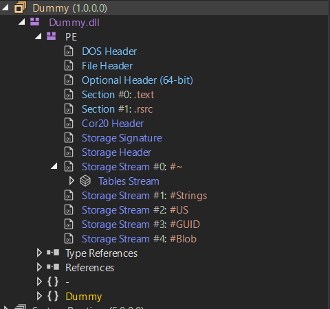
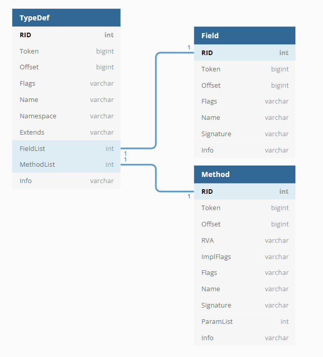

# Inspecting real application

For inspecting we can use dnSpy. Just publish a simple `hello world`-like application as winx64 hosted app and open single .dll with dnSpy.
It will look like this


What does all of dll-internals stand for?
- Firstly, it has a PE (Portable Executable):
- PE contains **DOS Header**. Header for disk operating system (of course Windows is such).
- There is file and optional header - other info about the file.
- **Section#0: .text** contains all the CIL code and metadata. **Storage streams** are inside the *.text section*
- Also there is a **.rsrc** section there.

## Storage Streams

**#~** is all metadata about types:
- Module (module definition)
- TypeRef - referenced types
- TypeDef - defined types
- Field - fields from all types
- Method - methods from all types

If you view tables carefully, you can spot simple relational-db schema:


- **#Strings** streams represents all built-in-strings (like type/method names)
- **#US** contains user defined strings ("hello world")
- **#GUID** defined GUID values
- **#Blob** all other inlined data

## How application executes
click exe -> runtime tries to find **Main** method and by **Token**. It looks for it's **RVA** (relative virtual address - address relative to the base address of image loaded into the memory).

## So how is the Main method represented?

```
header
[xx xx][xx xx][xx xx xx xx][xx xx xx xx]

CIL code
[xx xx ... xx]
```

So header has such sections:
- header flags (Fat Format, Init Locals, Size)
- maxstack
- code size
- local variables signature token. We take that value and find a row with same token value at **Method** table. There we can find a **Signature** column value and try to search for such an offset in **#Blob** stream. It defines a signature in such a value:

```
[xx][xx][xx][xx]
[length][LOCAL_SIG][varialbes count][ELEMENT_TYPE_I4]
```

