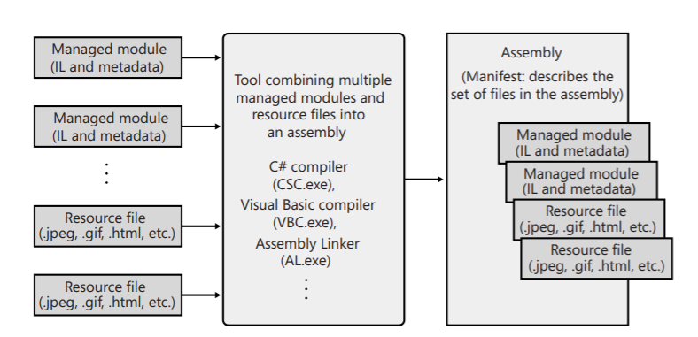

# Combining Managed Modules into Assemblies

CLR works with assemblies. **Assembly** is an abstract concept:
- it is a logical grouping of one or more modeuls or resource files.
- it is a smallest unit of reuse, security and versioning.

It is basically a conceptual notion that offers a way to treat a group of files as a single entity.

This figure shows what an assembly is. **Manifest**, that is a part of an assembly, is a set of metadata tables.

Assembly also includes the information about other referenced assemblies. So no additional scan is done in order to find all the dependencies.