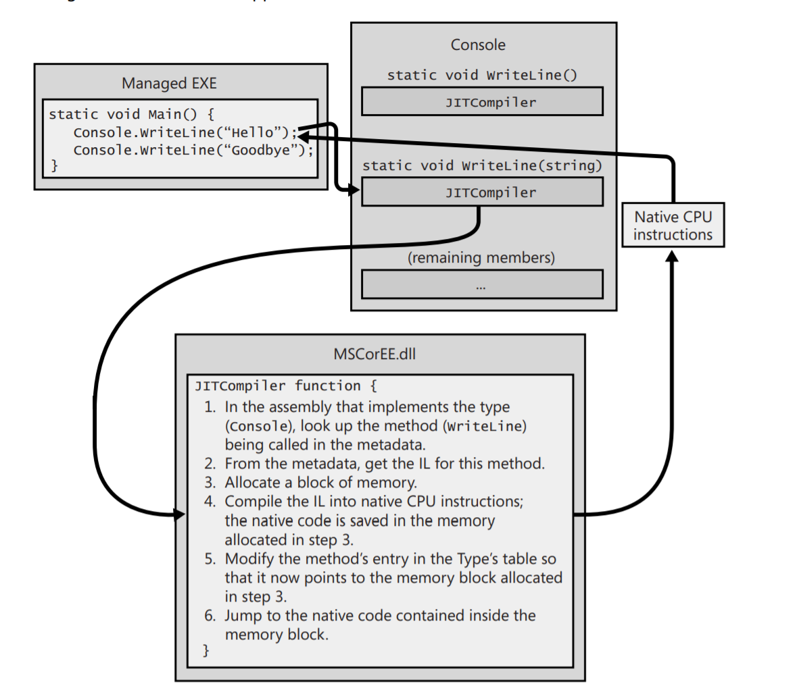
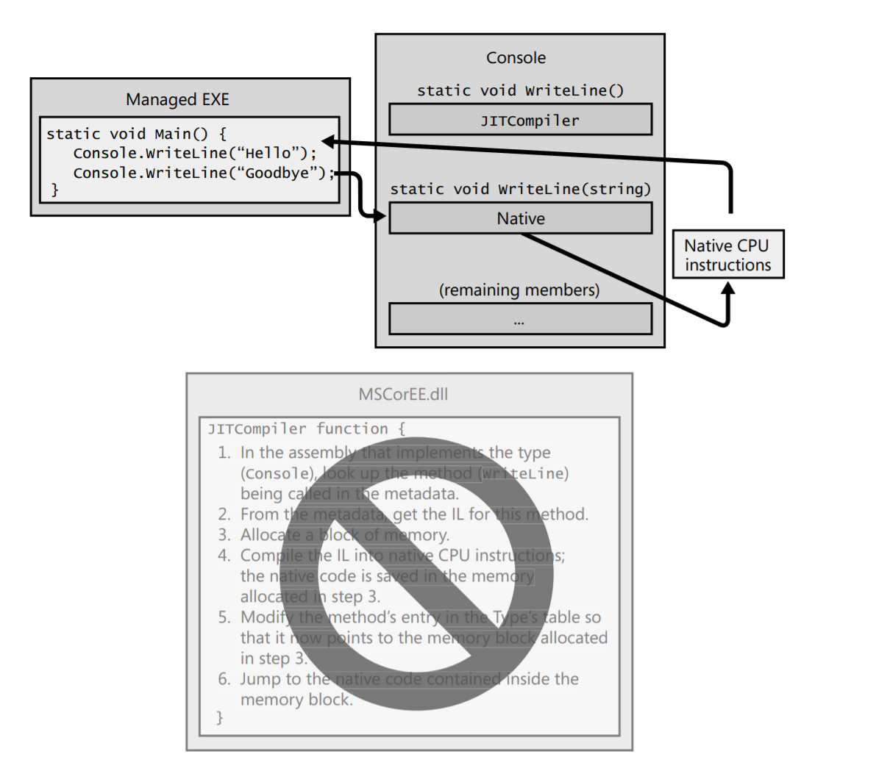

# Executing your Assembly Code
As we know, managed assemblies contain both metadata and IL. **IL (intermediate Language)** is a much higher-level language than most CPU machine languages. IL can access and manipulate object types and has instructions to create and initialize objects, call virtual methods on objects, manipulate array elements directly. It even has instructions to throw and catch exceptions for error handling. IL can be written in assembly language and Microsoft provides an `IL Assembler - ILAsm.exe` and IL Dissasembler `ILDasm.exe`.

To execute a method, its IL must first be converted to native CPU instructions. This is a job of the `CLR's JIT (just-in-time) compiler`.

This is a first call of `WriteLine` method

Just before `Main` method is executed, the CLR detects all the types that are referenced by `Main`'s code. This causes the CLR to allocate an internal data structure that is used to manage access to the referenced types. 

So Main method refers to a single type `Console` causing CLR to allocate a single internal structure. This internal data structure contains an entry for each method defined by `Console` type. Each entry holds the address where the method's implementation can be found. When initializing the structure, the CLR sets each entry to an internal function `JITCompiler`.

When `Main` makes a first call to `WriteLine`, the `JITCompiler` function is called and it compiles a method's IL code into native CPU instructions. Because the IL is being compiled `just in time`, this componenty of CLR is referred to as a `JIT Compiler`.

JIT Compiler just replaces the call `WriteLine` with the native CPU instructions (or just places a reference to a set of native CPU instructions. after method finishes execution, the compiler returns to the next row after `WriteLine` method).

Main calls `WriteLine` again. Now JIT compiler is not called, so the call goes directly into the block of memory with CPU instructions. 

This is a second call of `WriteLine` method flow.

JIT stores the native CPU instructions in dynamic memory, so every time the application is launched again, JIT has to recompile every method into native CPU instructions again.

Most applications dont tend to suffer from the JIT compiling, because they are designed to call the same methods all over again.

C# compiler has two switches: `/optimize` and `/debug`.
C# compiler with `/optimize-` produces the unoptimized IL code with lot's of no-operation instructions and branches that jump to the next lines of code. This allows debugging to work correctly. With `/optimiz+` it is working vice versa, also producing smaller and more understandable IL code.

Furthermore, the compiler produces a `Program Database (PDB)` file only if the `\debug+` switch. The PDB file helps the debugger find local variables and map the IL instructions to code.

## Why Managed Code with JIT works better than unmanaged (C++) one
- JIT compiler knows about the environment even more than an unmanaged code. I.e. if the application is running on an Intel Pentium 4, JIT uses all of the benefits of that architecture. 
- JIT can determine some conditions faster and even before an execution, because a boolean `var isSuperPc = numberOfCPUs > 1` is already known. Code becomes smaller and faster
- CLR can profile the code's execution and recompile the IL into native code while the application runs.

Also even if one is not satisfied with the performance, developer can use `NGen.exe` tool to compile all of an assembly's IL code into native code and save the resulting native code to a file on a disk. 

Also we can search for `System.Runtime.ProfileOptimization` class. It causes the CLR to record what methods get JIT compiled while the application is running. Then on a future startup the JIT compiler will concurrently compile these methods using other threads if your app is running on a machine with multiple CPUs.

## IL and Verification
IL is stack-based. 

IL instructions are also typeless. There are no separate versions for 32-bit and 64-bit of i.e. `add` operation.

IL provides the application robustness and security. While compiling IL into native CPU instructions, the CLR performs a verification. During this process the high-level IL code is ensured on code safety. I.e. verification checks that every method is of the correct type and that every method is called with the correct number of parameters and etc.

Each process has its own virtual address space in Windows. Separate address spaces are necessary because one can't trust an application code. By verifying the managed code, it is exactly not accessing address spaces of another running applications.

## Unsafe Code

C# can use `unsafe` keyword for producing unsafe code and allows accessing memory addresses directly. The application can be compiled with `/unsafe` switch. If all validation has passed, CLR assumes code runs well.