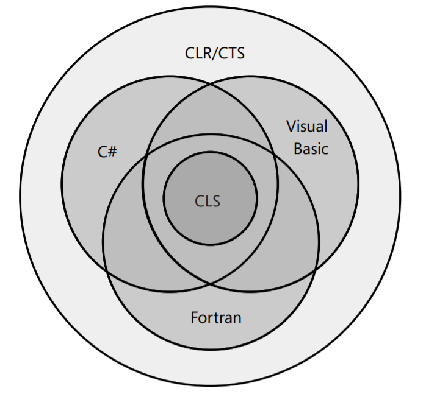

# The Common Language Specification
Common Language Specification is a `inner join` of all other languages so that CLS is the most general language specification with no advanced or specific stuff.



One can apply an assembly attribute to a class to check CLS compliance:

```
[assembly: CLSCompliant(true)]
// Warning: CLS has no `public` keyword available
public sealed class SomeLibraryType 
{
    // Warning: Return type is not CLS-Compliant
    public UInt32 Abs() { return 0; }
}
```

In CLR every member of a type is either a field (data) or a member (behaviour). This means any CLR programming language has to access fields and call methods. Complier translates all of the `advanced` stuff like properties and other to just fields or methods. I.e. `property {get}` is a method and `property {set}` is a method :)