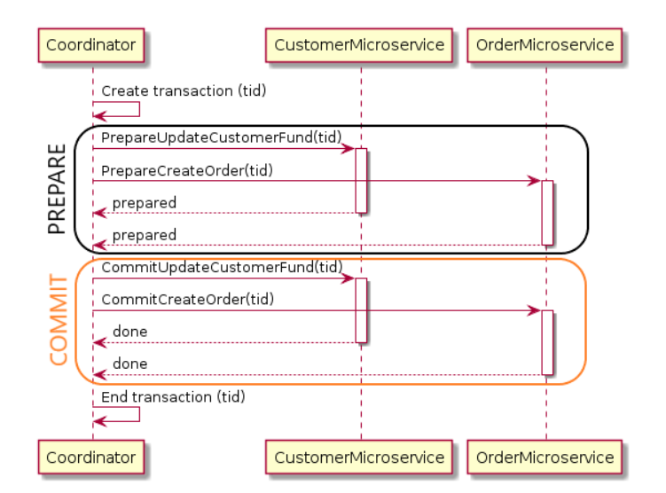

# How to support Distributed Transactions
Sources:
- Microsoft Azure, [Saga Distributed Transactions](https://docs.microsoft.com/en-us/azure/architecture/reference-architectures/saga/saga)
- Isuru Jayakantha, [Microservices : The SAGA Pattern for distributed transactions](https://medium.com/@ijayakantha/microservices-the-saga-pattern-for-distributed-transactions-c489d0ac0247)

---
There are some cases, where we need to implement distributed transactions because of multiple databases and etc. There are a couple of approaches to take:

## Two-Phase Commit
**Two Phase Commit (2PC)** consists of 2 stages:
- PREPARE
- COMMIT

Here is an example of create customer order two phase commit

*Pros*:
- well planned strategy
- easy to understand because of statefullness of that approach.

*Cons*:
- hard to implement
- no mechanism to rollback the other transaction is available (if one microservice goes down in the commit phase)
- others are waiting for the slowest microservice to respond with successful result of confirmation.

## SAGA Pattern
There are two ways to implement SAGA pattern:
- **Choreography**: each local transaction publishes domain events that trigger local transactions in other services
- **Orchestraction**: an orchestrator (object) tells the participants what local transactions to execute.

### Orchestration-based SAGA
We need to define a **Saga Execution Service** (SEC) with the sole responsibility to tell each service what operation to perform and when.

Let's look at specific stages of transaction:

1. `Order service` saves a pending order and asks SEC to start a create order transaction
2. `SEC` sends an *Execute Payment command* to `Payment service` and it replies with a *Payment executed message*
3. `SEC` sends a *Prepare Order command* to `Stock service` and it replies with an *Order prepared message*
4. `SEC` send a *Deliver Order command* to `Delivery service` and it replies with an *Order Delivered message*

**Pros**:
- no cyclic dependencies between services. All interaction is done using `SEC`
- easy to maintain unique ID for single distributed transaction
- avoids synchronous operations

**Cons**:
- complex approach
- we need to implement compensating transactions to have an availability to rollback transactions.