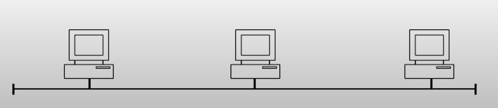
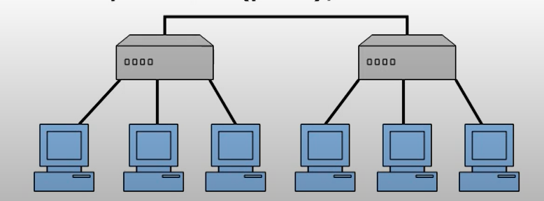
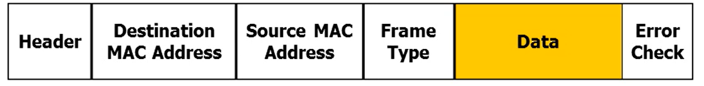
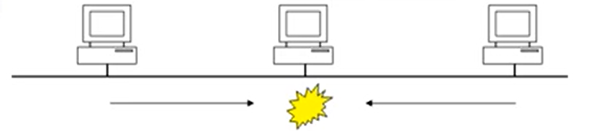

# Ethernet
**Ethernet** is a LAN (local area network) technology for transferring data 10Mbs to 1Gbs.

It is both a OSI Model **Physical** and **Data Link** layer specification:
- provides physical addressses (MAC)
- (encoding) frames IP packet and sends data (as 0 and 1) by turning it into electical waveforms
- (decoding) received the data by decoding the electical waveforms into a frame

## The OSI Model: Physical Layer
---
Physical Layer defines specifications for the physical components of the network (cabling, interconnection methids, data encoding and electrical properties). I.e. Ethernet specification IEEE 802.3 or Token Ring IEEE 802.5

## The OSI Model: Data Link Layer
---
Places and retrieves the data from the physical layer (cabling) and provides error detection activities

Steps:
- Addresses network devices (MAC address) *6 byte address*
- Places data in a data frame (packet)
- Gives the data bits to the Network Interface Card (NIC) by MAC address
- Controls the NIC's access to the Media
- Detects transmission errors

## Ethernet Interconnection Methods
---
**Bus** is a very cheap, but **not** failure tolerant

**Star** is more expensive, but failure tolerant, because sending a packet between computers in the same hub is separated from other hub

## Ethernet Addressing
---
Every single NIC has unique identifier - address (6 bytes long).
First 3 bytes are organization unique identifier.

## Ethernet II Framing
---
- **Header** has no data - just says you have a new packet incoming
- **Destination MAC address** - MAC address to which NIC the packet is going
- **Source MAC address** - MAC address of NIC that has sent a packet
- **Frame Type** - indicates the type of packet, i.e. *8137* is IPX, *0800* is IP, *0806* is ARP and etc.
- **Error Check** 

## Ethernet Media Access Control
- Any device can send a packet when ever they want
- All devices see all packets on physical segment (subnet)
- Only one device can transfer a packet at a time

These media access control is done by **Ethernet Carrier Sense Multiple Access/Collision Detection (CSMA/CD)**:
- each device will sense the line before sending a packet
- when a device sends a packet, it will try to determine if another device is sending at the same time (collision). Device will wait for the line to be free.

## Ethernet Processing Packet Flow
- Device waits if line is busy
- If not busy, the packet is sent and computer tries to detect a collision
- If no collision, all devices receive packet
- Each device receives the packet and first checks the CRC, if bad it is discarded
- If CRC is good, each device compares the destination MAC in packet to there MAC address (NIC card)
- If not for them, ignore the packet and wait for next
- If for them, check the Type field for the type of data in the packet and forward for continued processing

## Ethernet CSMA/CD Collision Example
- By chance two devices might send a packet at the same time.
- As the packet is sent, the systems try to detect a collision
- First one to sense collision sends out a jamming code to other devices
- All devices sending back off and generate a wait time, so that they don't jump back to sending packets at the same time
- Process repets

## Ethernet Error Detection or Cyclic Redundancy Check (CRC)
- before the data is sent, the unique number is calculated
- adds to the end of the data frame (trailer)
- recalculated upon the arrival. If it is the same before and after - Frame is OK, otherwise discarded