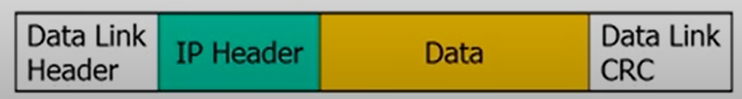
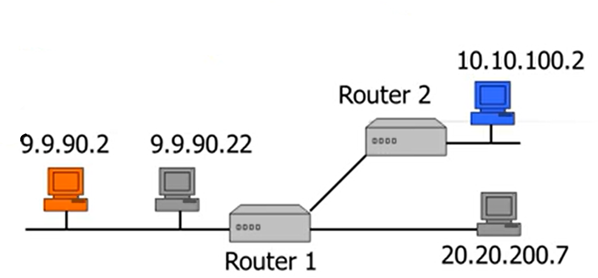
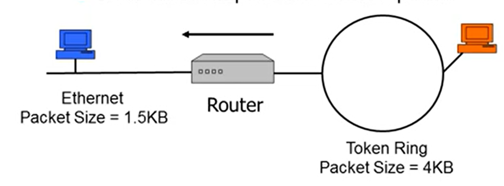

# IP aka Internel Protocol
Provides network-wide addressing and mechanism to move packets between multiple networks. It is already a network layer in the OSI model.

## Network Layer: Network-Wide Addressing
---
- MAC Addresses
    - unique addresses burned into NIC
    - Address and communicate between devices on the same physical segments

- Network Addressing
    - Network Wide Addresses
    - Aused to transfer data across physical segments (subnets)
    - Used by routers to forward packets

## IP Addresses
---
**IP address** is a 32-bit binary number expresssed as a series of four numbers separated by dots (207.77.105.9)
- Each device needs a **unique*** IP Address
- IP Addresses are configured in TCP/IP software manually or automatically via DHCP

Device needs not only unique IP address, but a **subnet mask**. It is a number that accompanies the IP and identifies which portion of the IP address is Network ID and which portion is Host ID.

Default Gateway is IP Address of the router on the same physical segment. It is used for remote connections

## Routing
---
Routing is the process of intelligently moving packets from one network to another.

- IP packets contain routing information.
- Routers are network-layer devices that use information in the IP packet to make routing decisions.

Hub in the Ethernet is sending a packet to all devices, but here there is a decision-making step to send a packet to some specific device.

## IP Packet Format
---
Not-coloured boxes *Data Link Header* and *Data Link CRC* are from the Ethernet protocol

**IP Header important fields:**
- Source IP Address
- Destination IP Address
- IP Packet Fragmentation (Identification, Fragment Flags, Fragment Offset)
- Packet Time to Live
- Protocol ID field (like TCP, UDP and etc)

## IP Packet Routing
---
- When router is turned on, he is trying to determine which networks they are connected to
- Routers then exchange network information via routing pprotocol like RIP, IGRP or BGP
- Routers build a table (routing table) that gives them the information to forward packets to the correct networks

## IP Routing Example
---
Imagine red computer sending a packet to blue computer.
- 9.9.90.2 creates IP packet for 10.10.100.2
- 9.0.90.2 sends packet to router 1
- Router 1 looks in it's route table to determine where to send the packet. Because on startup routers exchanged the information about known devices, router 1 knows it has to send the packet to router 2.
- Router 2 receives packet and looks in Route Table to determine where to sent the packet (local)
- Router 2 forwards packet to destination 10.10.100.2 computer

## IP Packet Fragmentation
---
A single IP packet can be subdivided by router into multiple packets during data transmission. There are several reasons for that:
- Maximum packet size is determined by Data Link Layer. In case of some network settings, routers will be fragmenting the packet into smaller ones. But it is quite expensive and slow.
- A packet could start on a network with a maximum size larger than the destination network
- Intermediate routers would fragment the packets to accomondate destination network

How the fragmentation works:
- The router divides the incoming packet into appropriate sized pieces (fragments)
- It adds an IP header to all of the fragmented packets that is identical to the original packet's header except:
    - add the same number to all the packets **Identifier** field
    - adds an inrementing number to the **Fragmenting Offset**
    - adds a flag to the **Fragmentation Flag** field to all but the last fragment packet
- Router then sends each fragmented packet to the destination

## IP Packet life (TTL)
---
There has to be a mechanism to prevent packet going round and round infinitely.

- When a packet leaves a computer the TTL field in the IP packet is set to a maximum of 256
- Each router will decrease the TTL by 1 or more
- If the TTL reaches Zero, the Router sends the source computer a ICMP-Time Exceeded and discards the packet
- This instructs the source computer not to send any more packet to the address (destination unreachable)

## IP Protocol (ID) Field
---
Ip can carry many different Upper Layer Protocols (ULP) packets: i.e. TCP, UDP, ICMP and etc.

So Ethernet sees **0800** and determines that packet is of IP type. Then IP in it's own header sees some type for TCP (i.e.) and handles the processing to the TCP module

