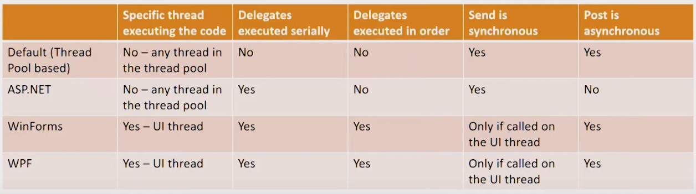

# Async Internals in .NET
Author - **Adam Furmanek**  
Conference - **Update Conference Prague**  
Link - https://youtu.be/FjIIbG9abM8  

---
## async and await and chaining
- await can be executed on anything awaitable - not necessarily a `Task`
- awaitable type must return a `GetAwaiter()` with the following:
    - implements `INotifyCompletion` interface
    - contains `bool IsCompleted { get; }`
    - contains `void OnCompleted(Action continuation)`
    - contains `TResult GetResult()` or `void GetResult()`
- async means nothing -> it only instructs the compiler to create a state machine

When `Task` is [scheduled and started](https://source.dot.net/System.Private.CoreLib/R/107ac97251bea153.html) there is a call to task scheduler [m_taskScheduler.InternalQueueTask(this);](https://source.dot.net/#System.Private.CoreLib/Task.cs,1681).

It is a special type that schedules tasks on the threads and makes sure that task is eventually executed. `TPL` and `PLINQ` is based on the thread pool.

We can easily implement our own [TaskScheduler](./MyTaskScheduler.cs)

`Task.ContinueWith` is just creating a continuation that executes asynchronously when the target task complets. Main logic in located at [void ContinueWithCore](https://source.dot.net/System.Private.CoreLib/R/0a28c847d772a11b.html), where [TaskContinuation](https://source.dot.net/#System.Private.CoreLib/Task.cs,4364) instance is created with type `ContinueWithTaskContinuation`. And then an [AddTaskContinuation](https://source.dot.net/#System.Private.CoreLib/Task.cs,4422) is called.

`Complete()` tries to [TrySetResult](https://source.dot.net/#System.Private.CoreLib/Task.cs,3225) for finishing. And then tries to call a continuation. But the continuation is scheduling and starting the continuation task. That`s all about a loop for continuationing tasks.

---
## Disposing a Task
A rule of thumb is `do not dispose a task`.  

Task **may** allocated `WaitHandle` which allocated `IDisposable`.
Disposing a `Task` in .NET 4 was making it unusable - we couldn't even schedule continuation.
In .NET 4.5 this was changed, `Task` is still usable, but `WaitHandle` is not.
Starting in .NET 4.5 `WaitHandle` is allocated only when it is explicitly accessed.

Summary:
- .NET 4 - **don't dispose** unless you have to. But you can not use `Task` instance anymore.
- .NET 4.5 - it should not make any difference, so **don't bother**.

---
## ValueTask
`Task` is a class, so it is allocated on the heap and needs to be collected by GC.
To avoid explicit allocation we can you `ValueTask`, which is a struct and is allocated on the stack.

See [PooledValueTaskSource](PooledValueTaskSource\Program.cs) by Konrad Kkokosa.

---
## Synchronization Context

`ISynchronizeInvoke` - life before `SynchronizationContext`.  
It provides a way to sync or async execute a delegate.
It ties communication and threads.
If we dont need specific thread - as in ASP.NET - we should **not** use `ISynchronizeInvoke`. So `SynchronizationContext` emerged.

`ExecutionContext` is a bag holding logical context of the execution.
Before .NET 4.5 `LogicalCallContext` was performing shadow copies and couldn't be used between asynchronous points of invocation.
Starting in .NET 4.6 there is an `AsyncLocal<T>` class working as TLS variables for tasks.
Methods with *unsafe* do not propagate the context - for instance `ThreadPool.UnsafeQueueUserWorkItem`.

`SynchronizationContext` class is a base class that provides a free-threaded context with no synchronization:
- `OperationStarted` and `OperationCompleted` => handles notifications
- `Send` - sync message
- `Post` - async message
- `Current` - gets synchronization context for the thread

**When awaiting the awaitable type the current context is captured.**
Effectively, synchronization context is a global variable.
- If `SynchronizationContext.Current` is not null, then this context is captured:
  - For UI thread it is a UI context - `WindowsFormsSynchronizationContext, DispatcherSynchronizationContext, WinRTSynchronizationContext, WinRTCoreDispatcherBasedSynchronizationCOntext`
  - For ASP.NET request it is an ASP.NET context - `AspNetSynchronizationCOntext`

- Otherwise it is current `TaskScheduler`:
  - `TaskScheduler.Default` is the thread pool context
  - ASP.NET Core doesn't have a separate context - no risk of deadlock, no need to use `ConfigureAwait(false)`

---
## State Machine
