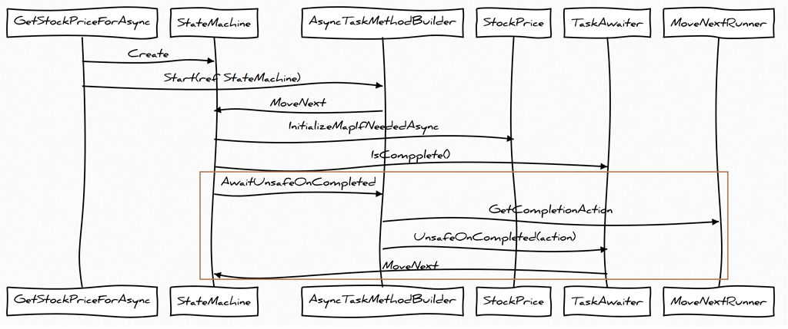

# Dissecting the async methods in C#
Source: [Dissecting the async methods in C#](https://devblogs.microsoft.com/premier-developer/dissecting-the-async-methods-in-c/)  
Author: **Sergey Tepliakov**

## Task history
`Task` represents a unit of work with a promise to give you results back in the future.

Task Parallel Library (TPL) had changed the way we think about concurrency and C# 5 changed asynchronous programming introducing key works `async` and `await`.

## Async methods internals
A regular method has a single entry point and a single exit point (at the runtime). But async methods and iterators (those with `yield return` inside of the methods) are different.

A method is an `async method` if it is marked with a contextual keywork `async`. Compiler already after that performs some special transformation to the method.

Consider [StockPrices class](./StockPrices.cs)
Method `GetStockPriceForAsync` ensures that the `_stockPrices` map is initialized and then gets the value from the cache.

## Deconstructing an async method by hand
Explore [GetStockPriceForAsync_StateMachine](./GetStockPriceForAsync_StateMachine.cs) class to view hand-written state-machine.

The general approach is to split internal method code between `await`s. And generate class with `Start()` method and `amount_of_awaits + 1` states.
Code, that is written before the first `await` is **state_1**, between 1st and 2nd is **state_2** and etc.

Every awaited task now becomes a field of the state machine:
```
// Step 1 of the generated state machine:
if (string.IsNullOrEmpty(_companyId)) throw new ArgumentNullException();
_initializeMapIfNeededTask = @this.InitializeMapIfNeeded();
```

`Start` method subscribes itself as a continuation of each of these tasks:
```
_state = State.Step1;
_initializeMapIfNeededTask.ContinueWith(_ => Start());
```

Also in each of next states the results of previous tasks is checked:
```
if (_initializeMapIfNeededTask.Status == TaskStatus.Canceled)
{
    _tcs.SetCanceled();
}
else if (_initializeMapIfNeededTask.Status == TaskStatus.Faulted)
{
    _tcs.SetException(_initializeMapIfNeededTask.Exception.InnerException);
}
```

When everything is done, the state machine sets the result of the `TaskCompletionSource<T>` instance and the resulting task returned from `GetStockPricesForAsync` changes its state to completed.

## Implementation conclusions
- Lots of heap allocations: 1 allocation for the state machine, 1 allocation for `TaskCompletionSource<T>`, 1 allocation for task inside a `TaskCompletionSource<T>`, 1 allocation for continuation delegate.
- Lack of “hot path optimizations”: if the awaited task was already finished there is no reason to create a continuation.
- Lack of extensibility: the implementation is tightly coupled with Task-based classes that makes it impossible to use with other scenarios, like awaiting other types or returning types other than `Task` or `Task<T>`.

## Async Machinery
1. Generated state machine that acts like a stack frame for an asynchronous method and contains all the logic from the original async method.
2. `AsyncTaskMethodBuilder<T>` that keeps the completed task (very similar to `TaskCompletionSource<T>` type) and manages the state transition of the state machine.
3. `TaskAwaiter<T>` that wraps a task and schedules continuations of it if needed.
4. `MoveNextRunner` that calls `IAsyncStateMachine.MoveNextmethod` in the correct execution context.

**The generated state machine is a class in debug mode and a struct in release mode**. All the other types (except MoveNextRunner class) are defined in the BCL as structs.

## The original method
Original “asynchronous” method creates a state machine instance, initializes it with the captured state (including this pointer if the method is not static) and then starts the execution by calling `AsyncTaskMethodBuilder<T>.Start` with the state machine instance passed by reference.

**Passing by reference is an important optimization**, because a state machine tends to be fairly large struct (>100 bytes) and passing it by reference avoids a redundant copy.

View [method with marked [AsyncStateMachine] attribute](./_GetStockPriceForAsync_d__1.cs) at `_GetStockPriceForAsync_d__1.cs`. Full state machine is also represented there.

## Improvements in generated state-machine
1. There is a check, if an awaitable action has already finished.
```
awaiter = __this.InitializeLocalStoreIfNeededAsync().GetAwaiter();
 
// Hot path optimization: if the task is completed,
// the state machine automatically moves to the next step
if (!awaiter.IsCompleted)
{
    // Irrelevant stuff
 
    // The following call will eventually cause boxing of the state machine.
    __builder.AwaitUnsafeOnCompleted(ref awaiter, ref this);
    return;
}
```

If the awaited task is already finished (successfully or not) the state machine moves forward to the next step:
```
// GetResult returns void, but it'll throw if the awaited task failed.
// This exception is catched later and changes the resulting task.
awaiter.GetResult();
__this._stocks.TryGetValue(companyId, out result);
```

**This means that if all awaited tasks are already completed the entire state machine will stay on the stack.** An async method even today could have an extremely small memory overhead if all awaited tasks are completed already or will complete synchroonously. The only remaining allocation would be for the task itself!

2. **There is no special logic which covers faulted or canceled state of the awaited tasks.** The state machine calls awaiter.GetResult() that will throw TaskCancelledException if the task was canceled or another exception if the task was failed. This is an elegant solution that works fine here because GetResult() is a bit different in terms of error handling than task.Wait() or task.Result.

`awaiter.GetResult()` “unwraps” an AggregateException and throw just the first failure.


The most interesting collaboration is happening when an awaited task **is not finished** (marked with the brown rectangle in the diagram):

- The state machine calls `__builder.AwaitUnsafeOnCompleted(ref awaiter, ref this);` to register itself as the task’s continuation.
- The builder makes sure that when the task is finished a `IAsyncStateMachine.MoveNext` method gets called:
- The builder captures the current `ExecutionContext` and creates a `MoveNextRunner` instance to associate it with the current state machine instance. Then it creates an `Action` instance from `MoveNextRunner.Run` that will move the state machine forward under the captured execution context.
- The builder calls `TaskAwaiter.UnsafeOnCompleted(action)` that schedules a given action as a continuation of an awaited task.