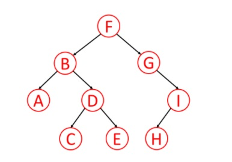

# Trees

## Definitions:
---
- **Binary Tree** - a tree data structure in which each node has at most two children, which are referred to as the left child and the right child.
- **N-ary Tree** - a tree data structure in which each node has at N children.
- **Binary Search Tree** - a tree data structure, where each node must be greater than (or equal) to any values in its left subtree but less (or equal) to any values in its right subtree
- **Trie** *(prefix tree)* - a data structure, usually used for storing strings. Each node represents `a string` (a prefix).
- **Red\black tree** - a kind of self-balancing binary search tree. Each node stores an extra bit representing 'color', used to ensure that the tree remains balanced during insertions and deletions.
- **Splay tree** - a binary search tree with the additional property that recently accessed elements are quick to access again. Basic operations such as insertions, look-up and removal in `O(log n)` amortized time.
- **AVL tree** - a binary search tree (as red\black), each node stores height of that node.

## Traversals:
---
Traversal is movement from node to another one in order to visit all nodes of tree.

### Definitions
*Definition examples below are based on this tree*  

- **Pre-order** - visits the root first, then the left subtree, then the right subtree  
    Pre-order traversal: `F B A D C E G I H` 
- **In-order** - visits left subtree first, then root, then right subtree
    In-order traversal: `A B C D E F G H I`
- **Post-order** - visits left subtree, then right subtree and only now root.
    Post-order traversal: `A C E D B H I G F`

### Algorithms
- BFS - basic traversal algorithm. Order of visits is following: root -> all neighbours -> all their neighbours and etc. Implemented using `queue`
    BFS traversal: `F B G A D I C E H`

- DFS - basic traversal algorithm. Order of visits is following: root -> first neighbour, its first neighbour, ... , second root's neighbour, its first neighbour and etc. So going in `depth` :)
    DFS traversal: `F B A D C E G I H`

## Representations
---
- **Matrix**: in columns and in rows there are names of nodes. Cross of column `A` and row `B` is the length of edge between `A - B`
- **Adjacency list**: a list of node-classes, every node-class has a list of neighbour nodes as a field.